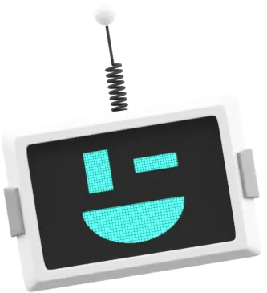
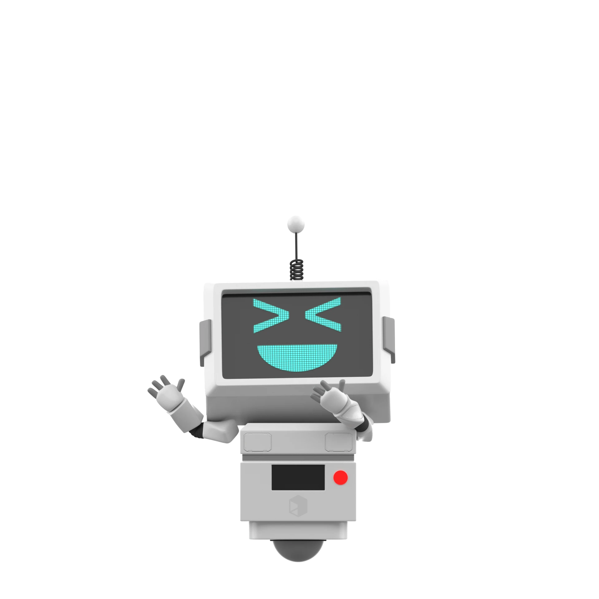
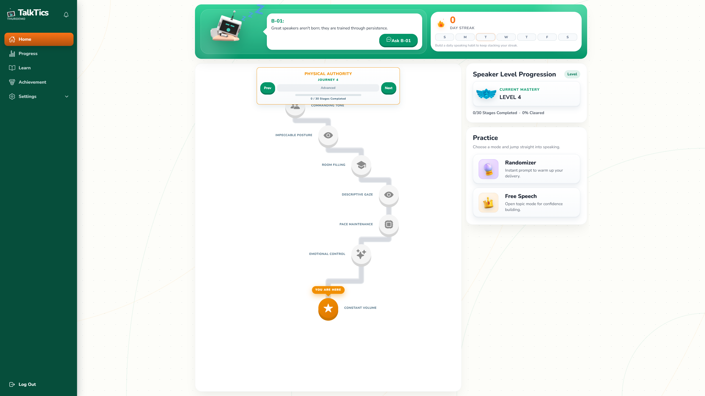
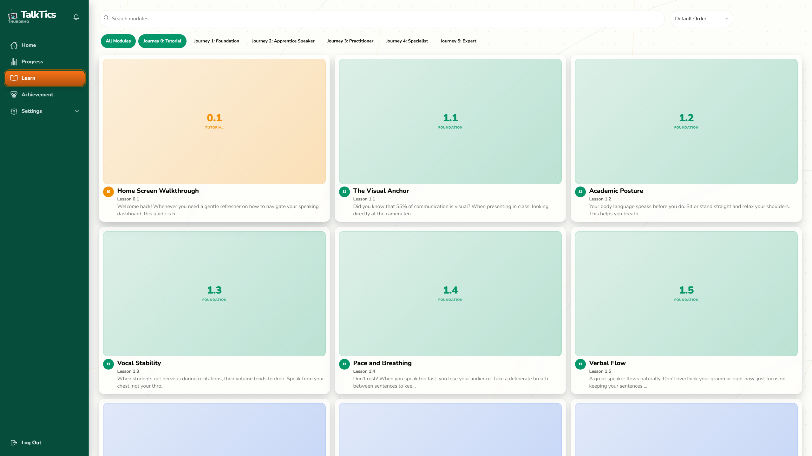
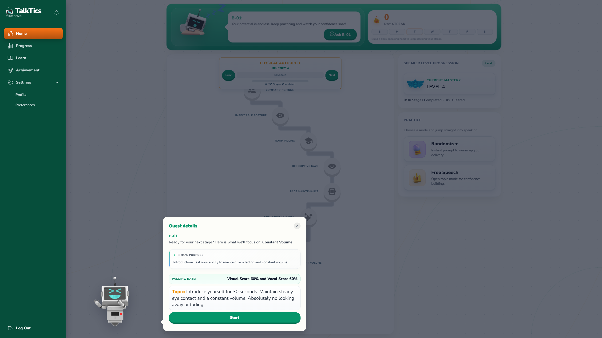
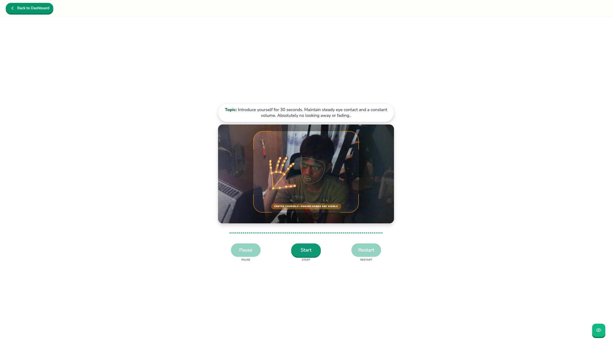
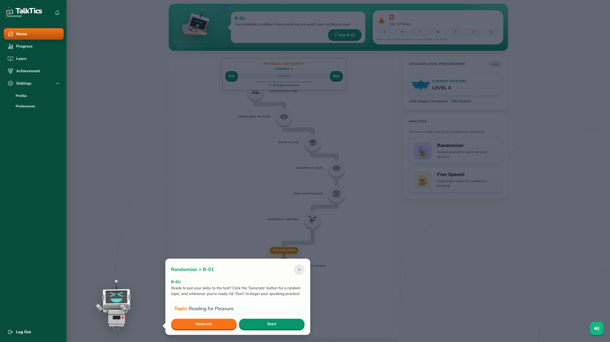
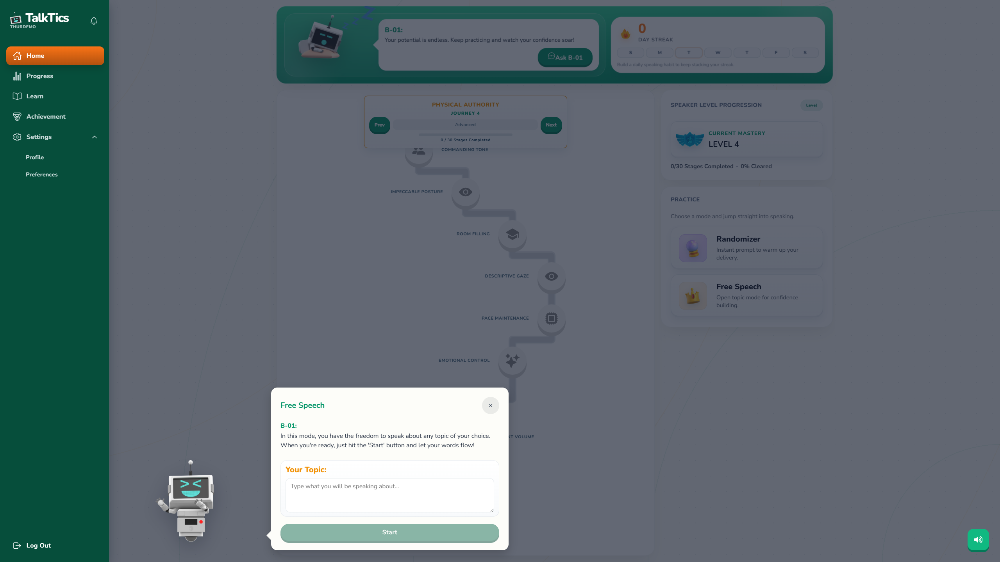
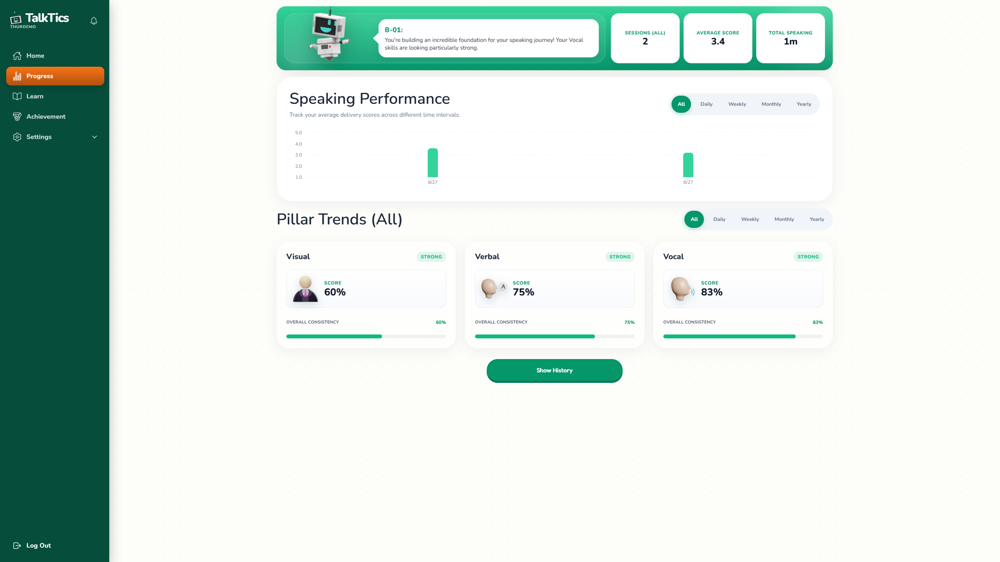
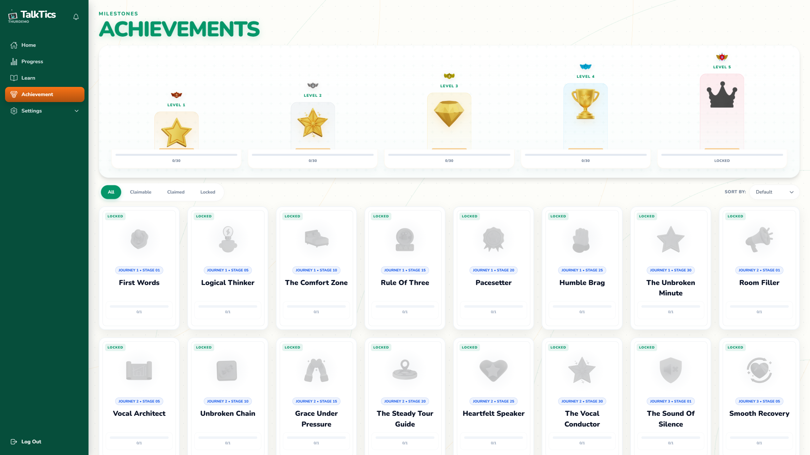

<div align="center">
  

  # TalkTics Web Application

  **Multimodal AI Public Speaking & Communication Coaching Platform with Real-Time Vision Mesh, Acoustic Biomarkers, and Edge NLP Intelligence**

  <p align="center">
    
    
    
    
    
  </p>
  <p align="center">
    
    
    
    
    
  </p>

  <p align="center">
    <a href="#executive-summary">Executive Summary</a> •
    <a href="#b-01-ai-speaking-coach-and-platform-mascot">B-01 AI Mascot</a> •
    <a href="#pedagogical-framework-and-theoretical-foundation">Pedagogical Framework</a> •
    <a href="#professional-validation-and-agile-methodology">Professional Validation</a> •
    <a href="#system-architecture">System Architecture</a> •
    <a href="#multimodal-analysis-engines">Multimodal Engines</a> •
    <a href="#user-interface-showcase">UI Showcase</a> •
    <a href="#technology-stack">Tech Stack</a> •
    <a href="#license-and-mascot-attribution">License & Credits</a>
  </p>

  <p align="center">
    Live Production: <a href="https://bigkas.site">https://bigkas.site</a> | Deployment Mirror: <a href="https://bigkas-capstone.pages.dev">https://bigkas-capstone.pages.dev</a>
  </p>
</div>

---

## Executive Summary

Public speaking anxiety remains one of the most prevalent barriers to academic and career success for collegiate students in the Philippines. Students preparing for thesis defenses, class recitations, and competitive job interviews frequently face high-stress evaluation without access to private, low-friction, and objective practice environments. Traditional speech coaching is often subjective, cost-prohibitive, and difficult to scale in institutional settings.

TalkTics (engineered as an academic capstone initiative) resolves these challenges by providing an automated, private, and mathematically calibrated training environment. By analyzing synchronized video feeds on the client and audio streams on high-performance edge/backend pipelines, the platform delivers instantaneous feedback on gaze stability, posture, vocal jitter, shimmer, speaking pace, topic relevance, and filler word density.

---

## B-01: AI Speaking Coach and Platform Mascot

<div align="center">
  
</div>

**B-01** serves as the interactive AI public speaking coach and official platform mascot of TalkTics. Designed to make speech training approachable and engaging, B-01 accompanies learners throughout every stage of their communication journey:

- **Onboarding and Hardware Calibration**: Guides users through microphone gain calibration, webcam framing, lighting checks, and initial confidence profiling.
- **Diagnostic Pre-Testing**: Conducts the interactive baseline evaluation, measuring non-verbal presence and vocal metrics before placing learners into their tailored mastery tier.
- **Real-Time Guidance and Dynamic Interventions**: Delivers contextual speech prompts, timer management, and constructive reminders during practice drills.
- **Post-Session Feedback and Growth Analytics**: Breaks down Triple-V scores, provides structured coaching recommendations, highlights disfluencies, and tracks streak milestones.

---

## Pedagogical Framework and Theoretical Foundation

### 1. Albert Mehrabian's Communication Rule (55 / 38 / 7)
The diagnostic engine of TalkTics implements Albert Mehrabian's foundational communication paradigm as a weighted baseline:
- **Visual (55%)**: Non-verbal presentation, gaze direction, eye contact stability, and body language.
- **Vocal (38%)**: Tone, pitch modulation, vocal steadiness (micro-tremors), volume dynamics, and pace.
- **Verbal (7%)**: Content clarity, vocabulary structure, filler word density, and contextual relevance.

### 2. Dual-Engine Diagnostic Entry Calibration
When learners first onboard, their competency level is established via a hybrid scoring formula combining subjective self-assessment with objective AI pre-testing:

$$\text{Final Diagnostic Score} = (\text{AI Pre-Test Score} \times 0.70) + (\text{Profiling Baseline} \times 0.30)$$

- **Profiling Baseline (30%)**: 9 targeted questions assessing confidence across Visual, Vocal, and Verbal domains.
- **AI Pre-Test (70%)**: Objective live multimodal evaluation calculated as:

$$\text{Pre-Test Score} = (\text{Visual Average} \times 0.55) + (\text{Vocal Average} \times 0.38) + (\text{Verbal Average} \times 0.07)$$

### 3. Integrated Speech Frameworks
TalkTics incorporates established communication models into its structured learning modules:
- **The 3-2-1 Trick (Vinh Giang)**: Impromptu speech structuring using 3 steps, 2 types, and 1 core concept to prevent rambling.
- **The P.R.E.P Framework**: Point, Reason, Example, Point iteration for formal arguments, panel recitations, and thesis defense.
- **The P.A.R.A Method**: Point, Action, Result, Ask for concise status updates, micro-stories, and project presentations.
- **The Throughline (Chris Anderson / TED)**: Unifying diverse presentation arguments under a singular central thesis.
- **StoryBrand SB7 (Donald Miller)**: Narrative framework positioning the audience as the hero and the presenter as the guide.

---

## Professional Validation and Agile Methodology

### Professional Expert Validation
The design, biomarker thresholds, and scoring heuristics of TalkTics were systematically validated through semi-structured interviews and technical consultations with domain professionals:
- **Speech-Language Pathologists (SLPs)**: Informed the clinical validity of acoustic tremor detection, vocal pitch stability ranges, and healthy vocal projection techniques.
- **Toastmasters International Members and Public Speaking Mentors**: Provided structural criteria for pacing thresholds (words/syllables per minute), eye contact fixation windows, and structured pause utilization.
- **Collegiate Faculty and Academic Defense Panelists**: Guided prompt creation and rubric design tailored to Philippine higher education defense standards and recitation formats.

### Agile Development Lifecycle
The platform was engineered using the Agile Scrum framework across 2-week sprint iterations:

| Sprint Phase | Focus Area | Deliverables |
| :--- | :--- | :--- |
| **Sprint 1: Research & Discovery** | Stakeholder & Expert Interviews | Literature review, domain expert consultations, system requirements specification, and heuristic baseline definition. |
| **Sprint 2: Architecture & PoC** | Computer Vision & DSP Pipeline | On-device MediaPipe Face Landmarker integration, Librosa feature extraction backend, and initial audio capture pipelines. |
| **Sprint 3: Core Multimodal Engine** | Scoring Heuristics & Backend | FastAPI scoring service, Cloudflare Workers AI transcription and semantic analysis, and database schema implementation in Supabase. |
| **Sprint 4: Frontend & Gamification** | Interactive Training Interface | React 19 UI overhaul, dynamic learning path, audio/video calibration suites, and progress tracking dashboards. |
| **Sprint 5: Mobile & Field Testing** | Cross-Platform Deployment | Capacitor Android build optimization, university student pilot testing, latency profiling, and WebAssembly caching enhancements. |
| **Sprint 6: Hardening & Release** | Production Optimization | Cloudflare Pages deployment, Dockerized backend deployment on Hugging Face Spaces, and responsive accessibility hardening. |

---

## System Architecture

TalkTics uses a decoupled, hybrid architecture designed for low-latency client interaction, privacy-preserving local computation, and scalable edge/cloud AI services.

```
+-------------------------------------------------------------------------------+
|                             CLIENT APPLICATION                                |
|   (React 19 / Vite / Tailwind CSS / Capacitor Android & iOS Runtime)          |
|                                                                               |
|  +-------------------------------------+  +--------------------------------+  |
|  |       MediaPipe Vision Engine       |  |      Web Audio API Pipeline    |  |
|  | - 468-point Face Mesh (WASM/GPU)    |  | - AudioBuffer Recording        |  |
|  | - Gaze Stability & Eye Contact      |  | - 16kHz WAV Serialization      |  |
|  | - 21-point Gesture Recognizer       |  | - Low-latency Microphone Meter |  |
|  | - Offscreen Canvas Luma Sampling    |  | - Hardware Diagnostic Suite    |  |
|  +-------------------------------------+  +--------------------------------+  |
+------------------------------------+------------------------------------------+
                                     |
                +--------------------+--------------------+
                |                                         |
                v (HTTPS / Multipart Form)                v (HTTPS / JSON)
+--------------------------------+       +------------------------------------+
|     FASTAPI DSP BACKEND        |       |     CLOUDFLARE AI WORKER (B-01)    |
|   (Python 3.11 / Uvicorn)      |       |      (V8 Edge Runtime / TS)        |
|                                |       |                                    |
| - FFmpeg Audio Transcoding     |       | - OpenAI Whisper Large v3 Turbo    |
| - Librosa Acoustic Extraction: |       | - Meta Llama 3.3 70B Semantic Eval |
|   * Probabilistic YIN (F0)     |       | - Deterministic Filler Word Engine |
|   * Pitch Jitter & Shimmer     |       | - Philippine English Dialect Match |
|   * Onset Pacing Detection     |       | - Groq / Google Gemini Fallbacks   |
|   * RMS Activity Thresholds    |       +-----------------+------------------+
| - Mehrabian Blending Engine    |                         |
+---------------+----------------+                         |
                |                                          |
                +--------------------+---------------------+
                                     |
                                     v (PostgreSQL via REST / RLS)
+-------------------------------------------------------------------------------+
|                             SUPABASE BACKEND                                  |
|  - PostgreSQL with Row-Level Security (RLS)                                   |
|  - User Authentication (Email & Google OAuth)                                 |
|  - Structured Session Records & Triple-V Performance Metrics                  |
|  - Gamification State (XP, Streaks, Trophies, Modules Progress)               |
+-------------------------------------------------------------------------------+
```

---

## Multimodal Analysis Engines

### Visual Lane: Google MediaPipe
Client-side visual processing runs entirely in the user's browser using `@mediapipe/tasks-vision` backed by WebAssembly (WASM) and WebGL/GPU acceleration.
- **468-Point Face Mesh (`face_landmarker.task`)**:
  - Gaze vector computation tracking the distance between the nose bridge (landmarks 1, 4, 6) and inter-pupillary center (landmarks 33, 133, 263, 362).
  - Head yaw offset calculation relative to inter-eye distance to detect audience disengagement.
- **21-Point Hand Gesture Recognizer (`gesture_recognizer.task`)**:
  - Multi-hand tracking calculating positional deltas and movement cadence to evaluate natural speaker gesturing.
- **Adaptive Execution & Luma Sampling**:
  - Throttled processing: 25 FPS during active speech sessions (40ms interval) and 5 FPS during introductory tutorials (200ms interval).
  - Off-screen 48x48 pixel canvas luma sampling running at 650ms intervals to issue automatic low-light warnings.

### Vocal Lane: Librosa Digital Signal Processing
The Python FastAPI backend processes spoken audio via high-precision DSP pipelines:
- **Fundamental Frequency (F0) Extraction**:
  - Extracted via the Probabilistic YIN (`librosa.pyin`) algorithm across the human vocal range (C2: 65.4 Hz to C5: 523.25 Hz) with 1024 hop length.
- **Vocal Jitter (Frequency Perturbation)**:
  - Measures cycle-to-cycle pitch variability:

$$\text{Jitter (\%)} = \frac{1}{N-1} \sum_{i=1}^{N-1} \frac{|F_{0,i+1} - F_{0,i}|}{F_{0,i}} \times 100$$

  - Captures micro-tremors and nervousness. Values under 15% represent natural intonation, while elevated values indicate vocal strain or anxiety.
- **Vocal Shimmer (Amplitude Perturbation)**:
  - Derived from successive Root Mean Square (RMS) frame-level energy differentials in decibels:

$$\text{Shimmer (dB)} = \frac{1}{M-1} \sum_{k=1}^{M-1} \left| 20 \log_{10} \left( \frac{\text{RMS}_{k+1}}{\text{RMS}_k} \right) \right|$$

  - Measures dynamic volume control and vocal projection consistency.
- **Pacing and Onset Detection**:
  - Evaluates onset envelope peaks (`librosa.onset.onset_detect`) normalized over recording duration to calculate Syllables/Words Per Minute.

### Verbal Lane: Edge ASR and LLM Intelligence
- **Speech-to-Text (ASR)**: Audio streams are transcribed verbatim via OpenAI Whisper Large v3 Turbo hosted on Cloudflare Workers AI and Groq API.
- **Deterministic Disfluency Classification**:
  - Hard Fillers: *um, uh, ah, er, erm, uhm, hmm, mm, mhm*.
  - Contextual Fillers: *like, basically, literally, actually, honestly, anyway*.
  - Filler Phrases: *you know, kind of, sort of, I mean*.
- **Semantic & Phonetic Analysis**:
  - Meta Llama 3.3 70B and Google Gemini Flash evaluate content relevance against topic prompts (1.0 to 5.0 scale).
  - Localized dictionary filters correct Philippine regional names and pronunciation variations (e.g., Dasmariñas, Cavite, Bulihan, Silang).

---

## Practice Lanes and Educational Curriculum

TalkTics provides four distinct practice modalities tailored to different stages of speaker development:

1. **Curriculum Journey**:
   - 5-Tier progressive mastery path consisting of structured lessons:
     - Level 0: Tutorial & Platform Navigation
     - Level 1: The Foundation of Presence (Visual Anchor, Posture, Vocal Stability)
     - Level 2: The Apprentice Orator (Projection, Deliberate Pauses, Emotional Tone)
     - Level 3: Increasing Knowledge (Structured Reasoning, PREP Framework)
     - Level 4: Building Skills (Extemporaneous Speaking, Objection Handling)
     - Level 5: Demonstrating Expertise (Keynotes, Defense Simulations)
2. **Impromptu Randomizer Mode**:
   - Generates contextual, slice-of-life public speaking prompts tailored to students to practice unscripted, spontaneous thinking under time constraints.
3. **Free Speech Sandbox**:
   - Unrestricted speaking workspace for practicing personal presentations, custom pitch decks, academic reports, and defense opening statements.
4. **Hardware Diagnostic Suite**:
   - Dedicated pre-flight check testing microphone levels, camera resolution, low-light conditions, and MediaPipe landmark tracking before entering scored sessions.

---

## User Interface Showcase

### Home Dashboard
The central command center providing access to current competency levels, daily speaking streaks, active curriculum modules, and quick-launch practice lanes.



---

### Structured Learning Modules
Curated curriculum catalog organizing theoretical speaking lessons, assignments, and guided practice drills.



---

### Interactive Speech Journey
Progressive node-based curriculum path mapping learner advancement across sequential mastery stages.



---

### Real-Time MediaPipe Vision Tracking
Live visual analysis overlay showing 468-point 3D face mesh tracking, gaze stability vector, and real-time eye-contact feedback.



---

### Impromptu Randomizer Mode
Spontaneous speaking practice presenting dynamically generated topics with structured timer controls and live metrics.



---

### Free Speech Practice Lane
Open-ended speech sandbox allowing learners to record custom speeches and receive comprehensive Triple-V evaluation reports.



---

### Progress Analytics and Historical Trends
Comprehensive performance analytics dashboard visualizing visual stability, vocal metrics, and verbal fluency over time.



---

### Gamification and Achievements
Badge system and milestone tracking designed to reinforce consistent speaking habits and reward deliberate practice.



---

## Technology Stack

| Layer | Technologies |
| :--- | :--- |
| **Frontend Framework** | React 19, JavaScript (ESNext), TypeScript |
| **Build & Tooling** | Vite, Tailwind CSS v4, ESLint |
| **Animation & UX** | Framer Motion, GSAP, Lenis Smooth Scroll, Lottie React |
| **Data Visualization** | Recharts, React Calendar Heatmap |
| **Computer Vision** | Google MediaPipe Vision (`@mediapipe/tasks-vision`), WebAssembly (WASM), WebGL |
| **Mobile Runtime** | Capacitor (Android & iOS Native Bridge) |
| **Backend Framework** | Python 3.11+, FastAPI, Uvicorn, Python-Multipart |
| **Digital Signal Processing** | Librosa, NumPy, SoundFile, FFmpeg |
| **Edge & AI Services** | Cloudflare Workers, Cloudflare Workers AI (Whisper Large v3 Turbo, Llama 3.1 / 3.3), Groq Cloud API, Google Gemini Flash |
| **Database & Auth** | Supabase (PostgreSQL, Row-Level Security, Auth) |
| **Distributed Caching** | Redis (Task State & Rate Limiting) |
| **Hosting & Deployment** | Cloudflare Pages (Web App), Docker / Hugging Face Spaces (Backend), GitHub Actions |

---

## Repository Structure

```
talktics/
├── android/                     # Android native project generated via Capacitor
├── b01-ai-worker/               # Cloudflare Workers edge AI service (TypeScript)
│   ├── src/
│   │   └── index.ts             # Whisper ASR, LLM coaching, and filler detection routes
│   ├── wrangler.jsonc           # Cloudflare Worker configuration
│   └── package.json
├── Capstone-Bigkas-Backend/     # Python FastAPI backend service
│   ├── Dockerfile               # Production container definition
│   ├── main.py                  # API endpoints, audio decoding, and DSP orchestrator
│   ├── scoring_logic.py         # Mehrabian 55/38/7 & diagnostic calibration logic
│   └── requirements.txt         # Python dependencies (FastAPI, Librosa, NumPy, etc.)
├── docs/                        # Project documentation and screenshots
│   └── images/                  # High-resolution application screenshots, logo & mascot
├── ios/                         # iOS native project generated via Capacitor
├── public/                      # Static assets, WebAssembly binaries, and web manifests
│   ├── models/                  # MediaPipe face and gesture task models
│   └── wasm/                    # MediaPipe WebAssembly execution runtime
├── src/                         # Frontend application source code
│   ├── assets/                  # Local vector assets, Lottie files, and frameworks JSON
│   ├── components/              # Modular UI components (Navigation, Modals, Audio meters)
│   ├── config/                  # Supabase client and environment configuration
│   ├── constants/               # Legal policies, navigation routes, and grading thresholds
│   ├── context/                 # React Context providers (Auth, Session state)
│   ├── data/                    # Static catalogs and curriculum module definitions
│   ├── hooks/                   # Custom hooks (useVisualAnalysis, useSessions, etc.)
│   ├── lib/                     # Sound effect engines (ZzFX) and third-party helpers
│   ├── pages/                   # Application views
│   │   ├── auth/                # Login, Registration, and Password recovery views
│   │   ├── landing/             # Public landing page with video presentation
│   │   ├── main/                # Dashboard, Training, Modules, Progress, and Settings
│   │   └── session/             # Scored session reports and detailed feedback breakdowns
│   ├── routes/                  # React Router definition with protected route guards
│   ├── services/                # Supabase data services (Achievements, Journey, Sessions)
│   └── utils/                   # Asset URL helpers, scoring adapters, and math utilities
├── capacitor.config.ts          # Capacitor cross-platform mobile bridge configuration
├── package.json                 # Web client dependencies and build scripts
└── vite.config.js               # Vite build pipeline and proxy configurations
```

---

## Privacy and Security Architecture

TalkTics was built with privacy-by-design principles to ensure compliance with student privacy requirements:
1. **On-Device Computer Vision**: Video frames captured from the user webcam are processed strictly in browser memory via WebAssembly. Video frames are never recorded, transmitted over the network, or stored on external servers.
2. **Ephemeral Audio Analysis**: Spoken audio uploaded to the backend is held in volatile memory buffers strictly for the duration of DSP extraction and Whisper transcription. Audio waveforms are discarded immediately after metrics calculation.
3. **Encrypted Telemetry**: Only calculated numerical scores (e.g., gaze stability percentage, jitter ratio, words per minute, and feedback summaries) are stored in the PostgreSQL database.
4. **Row-Level Security (RLS)**: Supabase PostgreSQL security policies restrict access so learners can only read and write their own speech session records.

---

## License and Mascot Attribution

### Project Status & License
This project is an academic capstone developed with the backing of university faculty and certified speech communication professionals. The source code and associated proprietary scoring calibrations are private and protected under an academic/institutional license.

### Public Web Access
While the codebase remains privately managed, the TalkTics platform is fully deployed, free to use, and publicly accessible for students, educators, and speech enthusiasts:
- Primary Production Domain: [https://bigkas.site](https://bigkas.site/)
- Cloudflare Pages Mirror: [https://bigkas-capstone.pages.dev](https://bigkas-capstone.pages.dev/)

### Mascot Attribution and Asset Credits
The **B-01** robot mascot character design and 2D sprite graphics utilized throughout the TalkTics interface are used under open/free licensing terms for educational, research, and non-commercial application use. 

All respective rights, trademarks, and original artistic credits for the robot sprite design belong to the original asset creator and artist community. We express our gratitude to the open creative community for making educational software development accessible.
